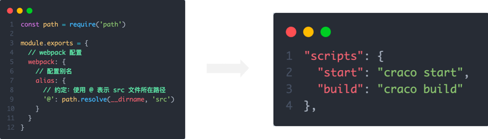
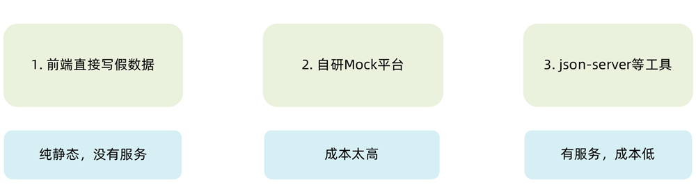
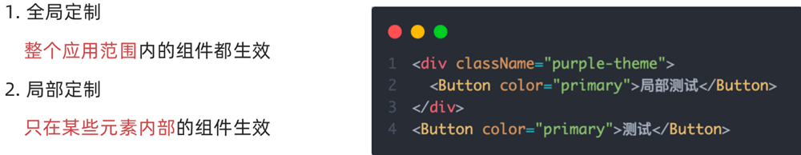

## 环境搭建

> CRA是一个底层基于webpack快速创建React项目的脚手架工具  
> 使用 CRA 创建项目，并安装必要依赖，包括下列基础包

1. Redux 状态管理 - @reduxjs/toolkit 、 react-redux
2. 路由 - react-router-dom
3. 时间处理 - dayjs
4. class 类名处理 - classnames
5. 移动端组件库 - antd-mobile
6. 请求插件 - axios

```bash
# 使用npx CRA 创建项目
npx create-react-app project-name
# 进入到项目
cd project-name
# 启动项目
npm start
```
**使用 Vite 创建项目**
> [Vite](https://cn.vitejs.dev/) 是一个框架无关的前端工具链工具，可以帮助我们快速创建一个 `react+ts` 的工程化环境出来，我们可以基于它做语法学习

```bash
npm create vite@latest react-typescript -- --template react-ts
# 安装依赖
npm i 
# 运行项目
npm run dev
```

### 项目目录结构
```bash
-src
  -apis           项目接口函数
  -assets         项目资源文件，比如，图片等
  -components     通用组件
  -pages          页面组件
  -store          集中状态管理
  -utils          工具，比如，token、axios 的封装等
  -App.js         根组件
  -index.css      全局样式
  -index.js       项目入口
```

## 配置别名路径

### 1. 背景知识

> 1. 路径解析配置（webpack），把 @/ 解析为 src/
> 2. 路径联想配置（VsCode），VsCode 在输入 @/ 时，自动联想出来对应的 src/下的子级目录

### 2. webpack 路径解析配置

配置步骤：

1. 安装 craco
   npm i -D @craco/craco
2. 项目根目录下创建配置文件
   craco.config.js
3. 配置文件中添加路径解析配置
4. 包文件中配置启动和打包命令



### 3. VSCode 联想路径配置

配置步骤：

1. 根目录下新增配置文件 - jsconfig.json
2. 添加路径提示配置

```json
{
  "compilerOptions": {
    "baseUrl": "./",
    "paths": {
      "@/*": ["src/*"]
    }
  }
}
```

## 数据 Mock 实现

> 在前后端分类的开发模式下，前端可以在没有实际后端接口的支持下先进行接口数据的模拟，进行正常的业务功能开发

### 1. 常见的 Mock 方式



### 2. json-server 实现 Mock

实现步骤：

1.  项目中安装 json-server
    npm i -D json-server
2.  准备一个 json 文件 （素材里获取）
3.  添加启动命令

```json
"server": "json-server ./server/data.json --port 8888"
```

4.  访问接口进行测试

## antD 主题定制

### 1. 定制方案



### 2. 实现方式

1. 全局定制

```css
:root:root {
  --adm-color-primary: #a062d4;
}
```

2. 局部定制

```css
.purple-theme {
  --adm-color-primary: #a062d4;
}
```
## 项目打包

```bash
npm run build
```

## 项目本地预览

**实现步骤**

1. 全局安装本地服务包 `npm i -g serve` 该包提供了 serve 命令，用来启动本地服务器
2. 在项目根目录中执行命令 `serve -s ./build` 在 build 目录中开启服务器
3. 在浏览器中访问：`http://localhost:3000/` 预览项目

## 优化-路由懒加载

**使用步骤**

1. 使用 lazy 方法导入路由组件
2. 使用内置的 Suspense 组件渲染路由组件

**代码实现**
`router/index.js`

```jsx
import { createBrowserRouter } from "react-router-dom"
import { lazy, Suspense } from "react"
import Login from "@/pages/Login"
import Layout from "@/pages/Layout"

import AuthRoute from "@/components/Auth"

const Publish = lazy(() => import("@/pages/Publish"))
const Article = lazy(() => import("@/pages/Article"))
const Home = lazy(() => import("@/pages/Article"))

const router = createBrowserRouter([
  {
    path: "/",
    element: (
      <AuthRoute>
        <Layout />
      </AuthRoute>
    ),
    children: [
      {
        index: true,
        element: (
          <Suspense fallback={"加载中"}>
            <Home />
          </Suspense>
        )
      },
      {
        path: "article",
        element: (
          <Suspense fallback={"加载中"}>
            <Article />
          </Suspense>
        )
      },
      {
        path: "publish",
        element: (
          <Suspense fallback={"加载中"}>
            <Publish />
          </Suspense>
        )
      }
    ]
  },
  {
    path: "/login",
    element: <Login />
  }
])

export default router
```

**查看效果**
我们可以在打包之后，通过切换路由，监控 network 面板资源的请求情况，验证是否分隔成功

## 打包-打包体积分析

**业务背景**
通过分析打包体积，才能知道项目中的哪部分内容体积过大，方便知道哪些包如何来优化
**使用步骤**

1. 安装分析打包体积的包：`npm i source-map-explorer`
2. 在 package.json 中的 scripts 标签中，添加分析打包体积的命令
3. 对项目打包：`npm run build`（如果已经打过包，可省略这一步）
4. 运行分析命令：`npm run analyze`
5. 通过浏览器打开的页面，分析图表中的包体积

**核心代码**：

```json
"scripts": {
  "analyze": "source-map-explorer 'build/static/js/*.js'",
}
```

## 优化-配置 CDN

**分析说明**：通过 craco 来修改 webpack 配置，从而实现 CDN 优化
**核心代码**
`craco.config.js`

```javascript
// 添加自定义对于webpack的配置

const path = require("path")
const { whenProd, getPlugin, pluginByName } = require("@craco/craco")

module.exports = {
  // webpack 配置
  webpack: {
    // 配置别名
    alias: {
      // 约定：使用 @ 表示 src 文件所在路径
      "@": path.resolve(__dirname, "src")
    },
    // 配置webpack
    // 配置CDN
    configure: (webpackConfig) => {
      let cdn = {
        js: []
      }
      whenProd(() => {
        // key: 不参与打包的包(由dependencies依赖项中的key决定)
        // value: cdn文件中 挂载于全局的变量名称 为了替换之前在开发环境下
        webpackConfig.externals = {
          react: "React",
          "react-dom": "ReactDOM"
        }
        // 配置现成的cdn资源地址
        // 实际开发的时候 用公司自己花钱买的cdn服务器
        cdn = {
          js: [
            "https://cdnjs.cloudflare.com/ajax/libs/react/18.1.0/umd/react.production.min.js",
            "https://cdnjs.cloudflare.com/ajax/libs/react-dom/18.1.0/umd/react-dom.production.min.js"
          ]
        }
      })

      // 通过 htmlWebpackPlugin插件 在public/index.html注入cdn资源url
      const { isFound, match } = getPlugin(
        webpackConfig,
        pluginByName("HtmlWebpackPlugin")
      )

      if (isFound) {
        // 找到了HtmlWebpackPlugin的插件
        match.userOptions.files = cdn
      }

      return webpackConfig
    }
  }
}
```

```html title="public/index.html"
<body>
  <div id="root"></div>
  <!-- 加载第三方包的 CDN 链接 -->
  <% htmlWebpackPlugin.options.files.js.forEach(cdnURL => { %>
  <script src="<%= cdnURL %>"></script>
  <% }) %>
</body>
```