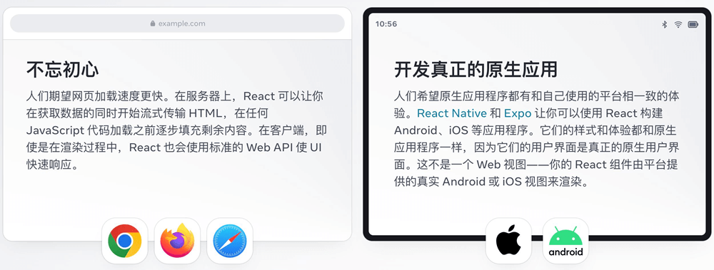
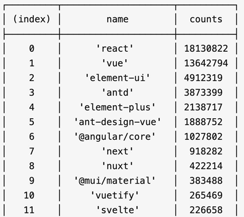

# React 介绍

React 由 Meta 公司开发，是一个用于 构建 Web 和原生交互界面的库


## React 的优势

相较于传统基于 DOM 开发的优势

1. 组件化的开发方式
2. 不错的性能

相较于其它前端框架的优势

1. 丰富的生态
2. 跨平台支持

## React 的市场情况

全球最流行，大厂必备  


## 开发环境创建

create-react-app 是一个快速创建 React 开发环境的工具，底层由 Webpack 构件，封装了配置细节，开箱即用
执行命令：

```bash
npx create-react-app react-basic
```

1. npx - Node.js 工具命令，查找并执行后续的包命令
2. create-react-app - 核心包（固定写法），用于创建 React 项目
3. react-basic React 项目的名称（可以自定义）

:::warning
创建 React 项目的更多方式
[https://zh-hans.react.dev/learn/start-a-new-react-project](https://zh-hans.react.dev/learn/start-a-new-react-project)
:::
